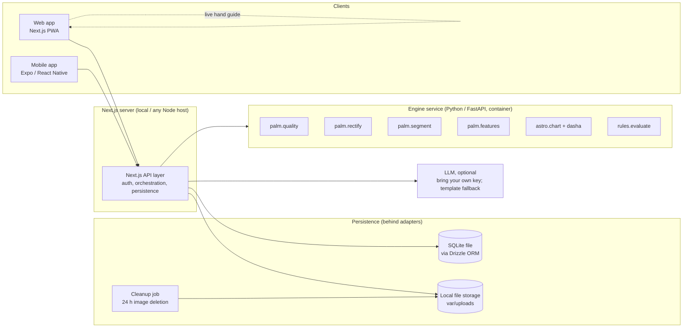
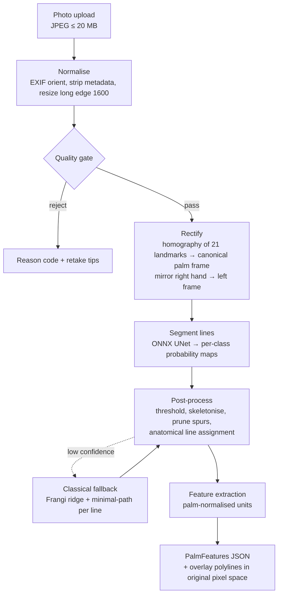
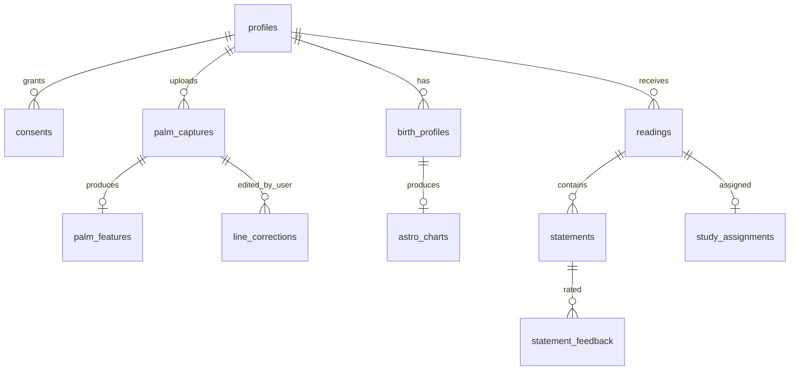

# Palmistry Portal: System Architecture

**Status:** Draft v2 (2026-09-29). Revised for an open-source R&D phase: SQLite, no payments, AGPL add-ons kept separate. See D-011 to D-014.
**Inputs:** [research/](../research/README.md), [DECISIONS.md](DECISIONS.md)
**Plan:** [IMPLEMENTATION-PLAN.md](IMPLEMENTATION-PLAN.md)

---

## 1. Goals and constraints

| Goal | Consequence for the design |
|---|---|
| Automated palm readings from a photo, with no palmist needed | Computer-vision pipeline, a rule engine, and an LLM that only narrates |
| **Palm and astrology built as independent engines** so a validation study is possible | Separate modules, inputs and outputs. Every statement records its source. A study harness with a control group. |
| **Open source during R&D and validation** (Apache-2.0 code, CC BY 4.0 rules and docs) | Contributors need no cloud accounts. `git clone` → one command → a running system. SQLite, local file storage, and an LLM that is optional (bring your own key; template fallback). |
| India and global storefronts from day one | Locale and market config, DPDP + GDPR/BIPA consent flows. **Payments are deferred** until the owner asks for them (D-013). |
| Web and mobile together | Monorepo with shared TypeScript contracts. One API serves both clients. |
| Solo builder working with Claude Code | Few deployable units, strong typing, a phased plan |
| Measure whether AGPL libraries (Swiss Ephemeris, PyJHora, YOLO…) are worth licensing | Pluggable provider interfaces. AGPL implementations live in a separate, optional `adapters-agpl/` package (D-011). |
| Honest and deterministic | Strict quality gate. Same palm → same features → same reading. Visible provenance ("why this sentence"). |
| Privacy-first | Raw images deleted after 24 h by default. Explicit biometric consent. Minimal retention. |
| Rules come from public-domain books, reviewed later by the owner | Versioned YAML rule base with citations, plus a review workflow |

**Non-goals for v1:**
- No health, lifespan or disease statements, ever.
- No blending of palm and astrology until the study has results.
- No human-astrologer marketplace.
- No payments or paywall.

---

## 2. System overview



**Deployable units:**

1. **Web app + API layer**: Next.js, run locally with `pnpm dev`, or on any Node host for a public demo.
2. **Mobile app**: Expo, run with Expo Go or a dev build.
3. **Engine service**: Python FastAPI, CPU only, ONNX inference.
4. **Persistence**: a single SQLite file plus a local uploads folder. There is no database server to install.

**One-command local run:**
- `docker compose up` starts web and engine, with volumes for `var/`.
- Without Docker: `pnpm dev` + `uv run engine`.

**Moving to hosted infrastructure later is an adapter swap, not a rewrite:**
- SQLite → Postgres (Neon or hosted Supabase) via the Drizzle Postgres dialect.
- Local storage → an S3-compatible bucket (for example Cloudflare R2).

See D-012.

**Why a single Python engine service?** Palm and astrology stay independent as *modules with separate inputs and outputs*. They do not need separate deployments. That keeps operations small for one builder while still guaranteeing the separation the study needs. Either module can be split into its own service later without changing the contract.

---

## 3. Repository layout (monorepo)

```
palmistry/
├── apps/
│   ├── web/                 # Next.js 15 (App Router), storefronts /in and /global, API routes
│   └── mobile/              # Expo (React Native), shares packages/*
├── packages/
│   ├── contracts/           # Generated TS types + zod schemas (from engine JSON Schemas)
│   ├── ui/                  # Shared design tokens, overlay renderer (SVG), report components
│   ├── i18n/                # en, hi (+ later regional) message catalogs, palmistry glossary
│   └── reading/             # Reading composer: rules output → narration request → statements
├── services/
│   └── engine/              # Python 3.12, FastAPI, uv
│       ├── palm/            # quality/ rectify/ segment/ features/ (pure functions, no I/O)
│       ├── astro/           # chart/ dasha/ (jyotishganit)
│       ├── rules/           # evaluator (JSONLogic) + loader
│       ├── api/             # FastAPI routers: /palm/analyze, /astro/chart, /rules/evaluate
│       ├── models/          # model cards only; weights are fetched by scripts/fetch-models.sh (git-ignored)
│       └── tests/
├── adapters-agpl/           # OPTIONAL, separately licensed AGPL-3.0 package (D-011):
│                            #   pyswisseph / PyJHora astro providers, YOLO experiments.
│                            #   Never imported by core; enabled with `uv sync --extra agpl`.
├── rules/                   # Rule base (YAML), CC BY 4.0; one file per topic; versioned
│   ├── palm/western/  palm/vedic/  palm/chinese/
│   └── astro/vedic/
├── ml/                      # Training code (SMP UNet), dataset manifests, eval scripts, notebooks
├── db/                      # Drizzle schema, migrations/*.sql, schema.sql (full snapshot), seed.sql
├── data/                    # GIT-IGNORED R&D images/datasets; only README.md + manifest.yaml committed
├── var/                     # GIT-IGNORED runtime: app.db (SQLite), uploads/
├── scripts/                 # fetch-data.sh, fetch-models.sh, db-reset.sh, cleanup-uploads.ts
├── research/                # Research reports (done)
├── docs/                    # Architecture, decisions, plan, resources registry, runbooks
├── LICENSE                  # Apache-2.0 (code)
├── LICENSE-CONTENT          # CC BY 4.0 (rules/, docs/, research/)
├── NOTICE  CONTRIBUTING.md  CODE_OF_CONDUCT.md  SECURITY.md
└── docker-compose.yml       # web + engine, one command
```

Tooling:
- pnpm workspaces + Turborepo for the TypeScript side.
- uv for Python.
- One GitHub Actions pipeline running lint, type-check, tests, the engine evaluation suite on committed synthetic fixtures, and a check that the generated contracts are in sync.

**Open-source contributor rules:**
- No real palm photos are ever committed. CI blocks image files outside `**/fixtures/synthetic/`.
- Datasets and model weights are reproducible via the `scripts/fetch-*` scripts plus `data/manifest.yaml`. Every entry records its source URL, licence and checksum.
- Contributions are signed off with the DCO (`git commit -s`) rather than a CLA. Apache-2.0 already allows the owner to build paid features later.

---

## 4. Palm engine

### 4.1 Pipeline



### 4.2 Quality gate (authoritative on the server; advisory on the client)

**Client side, advisory:**
- **Web:** `@mediapipe/tasks-vision` Hand Landmarker runs on the live camera feed. It shows a live guide ("open your fingers", "move closer") and auto-captures when all checks pass.
- **Mobile v1:** a static outline, then capture, then the server check. **Mobile v2:** on-device landmarks (see D-004).

**Server side, authoritative.** Uses MediaPipe Python on the uploaded still. Rejections are specific:

| Code | Check |
|---|---|
| `NO_HAND` | No hand landmarks found |
| `MULTIPLE_HANDS` | More than one hand |
| `BACK_OF_HAND` | Palm is not facing the camera. Checked with handedness plus the winding order of landmarks 0 → 5 → 17 and the thumb side. |
| `FINGERS_CLOSED` | Fingertip spread below threshold |
| `HAND_TOO_SMALL` | Palm bounding box is less than 35% of the shorter image side |
| `CROPPED` | Any required landmark (0, 1, 2, 5, 9, 13, 17) is outside the frame |
| `BLURRY` | Laplacian variance inside the palm region is below threshold |
| `TOO_DARK` / `OVEREXPOSED` | Luminance histogram of the palm region |
| `TILTED` | Palm plane angle too steep, estimated from landmark z-values or foreshortening |

**Rules for the gate:**
- A capture is **never charged or counted** until it passes.
- Thresholds live in config and are tuned on an evaluation set (§10).

### 4.3 Rectification (canonical palm frame)

- A homography maps landmarks {0, 1, 5, 9, 13, 17} onto a fixed canonical template. The template is a 1024×1024 palm frame with the wrist at the bottom and the finger bases at the top.
- Right hands are mirrored, so **all downstream code sees a left-hand frame**. Features are stored with a `hand: left|right` attribute.
- Every feature is measured in this frame, in **palm units**, where 1.0 = the distance from wrist landmark 0 to middle-finger base landmark 9. That makes features comparable across photos, phones and distances.
- The inverse homography is kept so that overlays can be drawn on the user's original photo.

### 4.4 Line segmentation

| Version | Model | Classes | Status |
|---|---|---|---|
| v0 (prototype) | `palm-line-reader` student_fp16.onnx (MIT code; **weights for the prototype only, never production**, see D-006) | heart, head, life | Phase 1 |
| v1 | Our own SMP UNet with MiT-b0/b2 encoder; loss = Dice + clDice + connectivity; ONNX fp16/int8 | heart, head, life, fate, sun, mercury | Phase 2 |
| v2 | Same model family plus a marks head | + girdle of Venus, marriage lines, bracelets, islands, crosses, stars | Later |

**Post-processing steps:**
1. Hysteresis threshold on each class's probability map.
2. Skeletonise.
3. Prune spurs shorter than 0.03 palm units.
4. Link segments along the dominant direction (splits a line into "broken" vs "continuous").
5. **Check each line's identity against anatomical priors**: the start and end zones must be plausible for that line. If the model's class disagrees with the zone, lower that line's confidence.

**Classical fallback / cross-check:**
- Method: Frangi filter with `black_ridges`, then a Dijkstra minimal path between anatomical start and end zones, using (1 − ridge strength) as the cost.
- Used when the model's confidence for a line is below threshold.
- Its agreement with the model is recorded as a confidence signal.

### 4.5 PalmFeatures contract (v1)

Defined as a Pydantic model in the engine. JSON Schema is exported to `packages/contracts`. Example:

```jsonc
{
  "schema_version": "palm_features.v1",
  "capture_id": "cap_…",
  "hand": "left",                        // physical hand photographed
  "dominant": true,                      // from user answer
  "pipeline": { "engine": "0.3.0", "segmenter": "plr-v0-fp16", "rectify": "h1", "gate": "g1" },
  "quality": { "score": 0.86, "blur": 0.91, "exposure": 0.8, "gate_version": "g1" },
  "hand_geometry": {
    "palm_length_width_ratio": 1.12,
    "finger_to_palm_ratio": 0.88,
    "element": "air",                    // derived from the two ratios above (Benham/Cheiro rule, documented)
    "digit_ratio_2d4d": 0.97,            // measured-fact layer, flagged low-precision
    "index_vs_ring": "ring_longer",
    "thumb_opening_deg": 52
  },
  "lines": {
    "heart": {
      "present": true, "confidence": 0.82, "source": "model",   // model | classical | user_corrected
      "length": 0.94, "start_zone": "percussion", "end_zone": "between_index_middle",
      "curvature_mean": 0.21, "slope_deg": -8, "breaks": 0, "forks_at_end": 1,
      "contrast": 0.63
    },
    "head":  { "present": true,  "…": "…", "joined_with_life_at_start": true },
    "life":  { "present": true,  "…": "…", "arc_width": 0.41 },
    "fate":  { "present": false, "confidence": 0.71 }
  },
  "topology": { "single_transverse_crease": false, "sydney_line": false },  // descriptive only
  "mount_zones": { "jupiter": [0.71, 0.24], "…": "…" },                   // positions only; no prominence in v1
  "overlay": { "space": "original_pixels", "width": 1200, "height": 1600,
               "polylines": { "heart": [[x, y], …], "…": "…" }, "landmarks": [[x, y], …] }
}
```

**Rules for this contract:**
- **Zones** are named regions defined in the canonical frame: percussion, under_jupiter, between_index_middle, under_saturn, thenar, and so on. That makes rules readable ("heart line ends under Jupiter").
- `topology.single_transverse_crease` is **descriptive only**. The rule base has no medical rules; this is enforced by a CI lint (§6.3).
- Anything the model cannot measure reliably is left out or given a low confidence. Rules with a `min_confidence` guard skip it.

### 4.6 Determinism and caching

- `feature_hash = sha256(canonical_json(PalmFeatures without overlay, pipeline ids))`
- A perceptual hash (pHash) of the rectified palm spots **re-uploads of the same photo**, and the stored reading is returned.
- Test–retest (two different photos of the same hand) is **measured, not assumed** (§10). Features are rounded to buckets before rule evaluation, so tiny measurement noise does not flip a reading.

---

## 5. Astrology engine (independent of the palm engine)

- **Library:** an `EphemerisProvider` / `DashaProvider` interface. See D-005 and D-011.
  - Default implementation: `jyotishganit` (MIT; Skyfield + JPL DE421).
  - Optional AGPL implementations in `adapters-agpl/`: pyswisseph (Swiss Ephemeris) and PyJHora.
  - A comparison harness runs every provider on the same charts. This produces the evidence for whether an AGPL or commercial licence is worth getting.
- **Inputs:**
  - DOB
  - birth time plus a `time_confidence` of exact, approx or unknown
  - place resolved to latitude, longitude and IANA timezone
  - ayanamsa: Lahiri by default
- **Outputs (contract `astro_chart.v1`):**
  - Lagna and the 12 houses, planetary positions and nakshatras.
  - Divisional charts D1 and D9.
  - **Vimshottari dasha**: maha and antar periods with dates.
  - Current period.
  - An `uncertainty` block. When birth time is approximate or unknown, the Lagna and houses are flagged `unstable` and time-sensitive rules are skipped.
- **Validation:** the engine's output for 30 reference charts is compared with JHora or PyJHora output. PyJHora is AGPL and runs via `adapters-agpl` only. Tolerances: planet longitude < 0.05°, dasha boundary < 1 day.
- **Geocoding (offline, D-016):**
  - Places: an in-memory index of GeoNames `cities5000` (~70k places worldwide, CC BY 4.0) inside the engine, served by `GET /v1/places`. It matches official, old (Bombay, Allahabad) and native-script names. Villages under 5,000 people are not covered; the fallback is to pick the nearest town, or later a larger GeoNames extract (`allCountries` for India).
  - Timezone and historical offsets: `timezonefinder` + `zoneinfo`.

The astrology engine never sees palm data, and the palm engine never sees birth data.

---

## 6. Rule base and interpretation

### 6.1 Rule format

Rules are YAML, one file per topic, validated against a JSON Schema in CI:

```yaml
- id: palm.heart.end.under_jupiter
  tradition: western            # western | vedic | chinese
  engine: palm                  # palm | astro   (never both in v1)
  domain: love_relationships    # fixed taxonomy (§6.2)
  when:                         # JSONLogic over the features JSON
    and:
      - { "==": [ { var: lines.heart.end_zone }, "under_jupiter" ] }
      - { ">=": [ { var: lines.heart.confidence }, 0.6 ] }
  statement_key: heart_end_jupiter      # stable key → i18n templates + narration seed
  polarity: positive            # positive | neutral | caution
  strength: 2                   # 1–3, for ranking/selection
  excludes: [palm.heart.end.under_saturn]
  source:
    work: "Benham, The Laws of Scientific Hand Reading (1900)"
    locator: "ch. XX, p. 245"   # to be filled during extraction
  review:
    status: extracted           # extracted → reviewed → approved | rejected
    reviewer: null
    notes: ""
```

**How rules are evaluated:**
- JSONLogic has maintained Python and JavaScript implementations, so rules can be evaluated on the server and unit-tested on either side.
- Selection works like this:
  1. Every rule whose condition matches fires.
  2. Mutually exclusive rules (`excludes`) are resolved by strength.
  3. The top N rules per domain are kept.

  The result is deterministic for a given feature hash and rule-base version.
- `rulebase_version` is the git SHA plus a semantic version. Each approved release is snapshotted to a DB table for auditing.

### 6.2 Domain taxonomy

| Domain key | Topic |
|---|---|
| `personality_temperament` | Personality and temperament |
| `mind_learning` | Mind and learning |
| `love_relationships` | Love and relationships |
| `career_work` | Career and work |
| `money_resources` | Money and resources |
| `vitality_energy` | Vitality and energy. Framed as lifestyle energy, never health. |
| `life_path_timing` | Life path and timing |
| `measured_facts` | Non-interpretive measurements |

Palm and astrology rules use **the same domains**. That is what lets the study compare them domain by domain.

### 6.3 Guardrails, enforced in CI

A rule-lint job blocks:
- any rule in a banned category: health, disease, lifespan, death, fertility, pregnancy, accidents, legal or financial advice;
- any rule without a `source`;
- any `approved` rule without a reviewer.

The narrator prompt enforces the same ban list, and a post-generation filter re-checks the output (§7).

### 6.4 Extraction workflow (from books)

1. Obtain the texts:
   - OCR scans: Benham, Cheiro *Language of the Hand*, Samudrika 1916.
   - Plain text: Gutenberg editions of Cheiro and Dale.
2. An LLM extracts **candidate rules** into the YAML schema, with the page as the locator. Status: `extracted`.
3. A script checks that every `when` clause only references features that exist in `palm_features.v1`. Rules that need features we don't have yet go to a `backlog/` folder.
4. You review the rules in a simple review UI (Phase 4) or directly in YAML. Status: `reviewed` → `approved`.
5. Only `approved` rules run in production. `reviewed` rules can run in a staging or study arm.

---

## 7. Reading composition and narration

```mermaid
sequenceDiagram
  participant C as Client
  participant B as API layer (Next.js)
  participant E as Engine
  participant L as Claude API
  participant D as Postgres

  C->>B: POST /api/readings {kind: palm|astro|combined}
  B->>E: /rules/evaluate {features or chart, rulebase_version}
  E-->>B: fired rules (ids, domain, polarity, strength, statement_key)
  B->>D: lookup narration cache (hash(inputs, rulebase, narrator, locale))
  alt cache miss
    B->>L: structured prompt: fired rules + glossary + style guide, temp 0
    L-->>B: JSON [{text, rule_ids[], domain}]
    B->>B: validate: every sentence cites ≥1 fired rule; ban-list filter; length limits
  end
  B->>D: store reading + statements (with provenance)
  B-->>C: reading (statements, overlay, "why" links)
```

- **Model:** optional and configurable through a `Narrator` interface.
  - The default for contributors is `template`, which needs no API key.
  - `anthropic` (Haiku 4.5 or Sonnet 5.5) or any OpenAI-compatible endpoint (including local models via Ollama) can be switched on with environment variables.
- **The narrator is only given fired rules**, plus the few feature values those rules reference ("heart line ends under the index finger"). It is **never** given the photo.
- **The output is structured**, with one statement per claim. Any sentence without a valid `rule_id` is dropped and the attempt is logged.
- **Fallback:** if the LLM fails, every `statement_key` has an i18n template, so a reading can always be produced without the LLM.
- **Languages:** English and Hindi first. The narrator writes directly in the target language using a glossary (हृदय रेखा, मस्तिष्क रेखा, जीवन रेखा, भाग्य रेखा…).
- **Every statement is stored with:**
  - `source_engine` (palm | astro)
  - `rule_ids[]`
  - `feature_refs[]`
  - `domain`
  - `arm` (§8)
  - `rulebase_version`
  - `narrator_version`

---

## 8. Validation study harness

This is the product's differentiator and the reason the engines are kept separate.

| Arm | Content |
|---|---|
| `palm` | Statements from the palm engine only |
| `astro` | Statements from the astrology engine only |
| `combined` | Both, each labelled with its source. v1 simply shows them side by side, with no blending logic. |
| `control_shuffled` | A reading generated from **another consenting user's** palm features (matched on hand and dominance) or chart (matched on age band). This measures the Barnum baseline. |

**Design:**
- **Enrolment:**
  - Opt-in consent for "research mode", with a plain-language explanation that one of your readings may be an experimental version.
  - Adults only.
  - A debrief is shown after the rating is submitted, revealing which arm was shown.
- **Assignment:** randomised and stratified by market and hand. Stored in `study_assignments`. Neither the user nor the narrator knows the arm; the UI is identical.
- **Measures:**
  - A rating of each statement (1–5 "fits me").
  - An overall rating.
  - An optional forced choice: "which of these two readings is yours?" This is the classic blinded test and the strongest single measure.
- **Prospective module (later):** store dated astrology predictions and palm "tendency" claims, then send check-in prompts at 3, 6 and 12 months about life events.
- **Pre-registration:** hypotheses, primary metric (forced-choice hit rate vs the 50% chance level) and sample size are written into `docs/study/PREREGISTRATION.md` **before** any data is collected.
- **Analysis:** export via SQL views (no personal data) and a notebook in `ml/study/`.

---

## 9. Data model (SQLite for the POC, portable to Postgres)

**Stack:**
- **Drizzle ORM** with `better-sqlite3`.
- The database is one file, `var/app.db`.
- **One-click setup:**
  - `pnpm db:migrate` applies `db/migrations/*.sql` in order.
  - `pnpm db:reset` deletes the file, re-applies `db/schema.sql` (a full snapshot, runnable with `sqlite3 var/app.db < db/schema.sql`) and seeds it.

**Portability conventions** (so a later move to Postgres is mechanical):
- Text IDs (ULID).
- ISO-8601 UTC timestamps stored as TEXT.
- JSON stored as TEXT and validated by zod.
- Arrays stored as JSON.
- No SQLite-only functions in queries.
- Every migration is plain SQL and reviewed in the PR.

**Authorisation:** SQLite has no Postgres-style row-level security (RLS). Every query goes through a repository layer (`findById`, `create`…) that always scopes by `profile_id`, and tests assert that one profile can never read another's rows. Engine and study tables are written only by server code.

**Auth (Phase 5):** Better Auth (MIT), which supports SQLite and Postgres. Before Phase 5 there are no accounts; the `/lab` pages use a local anonymous profile.

The table definitions below are unchanged; types map to SQLite as described above.



| Table | Key columns | Notes |
|---|---|---|
| `profiles` | id (= auth.uid), market (`in`/`global`), locale, birth_year, is_adult | Minimal personal data |
| `consents` | profile_id, type (`processing`, `biometric`, `retain_images`, `training_data`, `research`), version, granted_at, withdrawn_at | Append-only; append a withdrawal to revoke |
| `palm_captures` | id, profile_id, hand, dominant, status, gate_result jsonb, storage_path (nullable), image_expires_at, image_deleted_at, phash | The raw image is deleted after 24 h unless `retain_images` consent exists |
| `palm_features` | capture_id, schema_version, features jsonb, feature_hash, pipeline jsonb | Derived data; no image |
| `line_corrections` | capture_id, line, polyline jsonb, created_at | Becomes training data only with `training_data` consent |
| `birth_profiles` | id, profile_id, dob, time, time_confidence, place_name, lat, lon, tz | |
| `astro_charts` | birth_profile_id, schema_version, chart jsonb, engine_version | |
| `readings` | id, profile_id, kind, inputs jsonb (capture/chart ids), rulebase_version, narrator_version, locale, status | |
| `statements` | reading_id, ord, text, source_engine, rule_ids text[], feature_refs text[], domain, polarity | |
| `statement_feedback` | statement_id, rating, created_at | |
| `study_assignments` | reading_id, arm, control_source_id, stratum | Hidden from the client until debrief |
| `rulebase_releases` | version, sha, rules jsonb, released_at | Audit trail |
| `training_samples` | capture_id, image_path, mask_path, split, license=`user_consented` | Separate folder with strict access |

`orders` is **deferred** (D-013). It is not created in the POC schema and is not shown in the diagram.

**Storage** goes through a `StorageAdapter`. In the POC this is the local filesystem under `var/uploads/` (git-ignored); later it can be S3-compatible. There are three areas:
- `captures-tmp/`: 24 h lifecycle. `scripts/cleanup-uploads.ts` runs on a schedule (node-cron inside the server, or a system cron job). It deletes expired files and sets `image_deleted_at`. A test proves this works.
- `captures-retained/`: only with explicit consent.
- `training/`: only with training consent.
---

## 10. Evaluation and quality gates

| Suite | Data | Target for Phase 1 exit |
|---|---|---|
| Non-palm rejection | 200 negatives: backs of hands, feet, paws, faces, objects, drawings | ≥ 97% rejected |
| Gate false rejects | 100 good palm photos | ≤ 5% rejected |
| Line detection | 60 owner-annotated palms (polylines) | Per-line recall ≥ 0.85 for heart/head/life; clDice reported |
| Test–retest | 20 hands × 3 photos (different light and phone) | Categorical features agree ≥ 85%; reading statements overlap (Jaccard) ≥ 0.7 |
| Latency | — | p95 engine time < 2.5 s on 2 vCPU |
| Fairness slice | Skin tone (Monk scale buckets), age band | No slice more than 10 points below the overall recall |

These run in CI (`services/engine/tests/eval/`) against a small committed fixture set. The full set runs on demand, and results are written to `docs/eval/`, which later feeds the public "accuracy and consistency" page.

---

## 11. Security, privacy and compliance

- **Consent before capture.**
  - A plain-language screen (English and Hindi) states what happens to the photo, the 24 h deletion and the AI sub-processors.
  - A separate checkbox covers biometric processing (needed for BIPA/GDPR; good practice under DPDP).
  - 18+ gate.
- **Data minimisation:**
  - EXIF is stripped.
  - Images are resized to a long edge of 1600 px.
  - Only derived features are kept by default.
  - **The palm image is never sent to the LLM.**
- **Sub-processors:** none in local or contributor setups. A public demo lists its host and its LLM provider (text only, no-training terms). Payment processors are added only when D-013 is lifted.
- **Rights:**
  - Export my data, delete my account (cascade delete), and withdraw consent (stops future processing and removes training samples).
  - DPDP grievance contact.
  - GDPR data subject request flow.
- **Abuse protection:**
  - Cloudflare Turnstile on web uploads.
  - Rate limits per IP, device and account (Postgres-backed token bucket or Upstash).
  - Upload validation: MIME sniffing, size limit, decode inside a sandboxed worker.
- **Secrets:** environment variables only (`.env.local`, git-ignored; `.env.example` committed). The engine is reachable only from the API layer, via a shared HMAC or OIDC service identity.
- **Engine hardening:**
  - No filesystem persistence.
  - Images are processed in memory.
  - A limit on concurrent requests.
- **Logging:** structured logs that never contain images or birth data, only IDs. Errors go to Sentry, with personal data scrubbed.
- **Legal pages:** privacy policy, terms, the "for entertainment and self-reflection" disclaimer, the method and evidence page, and the subscription terms (when relevant).

---

## 12. Client applications

### Web (Next.js)
- **Routes:** `/[market]/[locale]/…` (e.g. `/in/hi/scan`, `/global/en/scan`). Market config holds legal copy, consent text and default tradition labels (Hast Rekha vs Western). Currency, pricing and payment provider are added only when D-013 is lifted.
- **Scan flow:**
  1. Consent.
  2. Hand choice (dominant, and the option to add the other hand).
  3. Live camera guide, using MediaPipe WASM in a Web Worker.
  4. Auto-capture.
  5. Upload.
  6. Progress screen.
  7. **Overlay review**, with a "this line is wrong, adjust" editor.
  8. Reading.
- **Report UI:**
  - Each statement has a source badge ("From your palm", "From your birth chart"), plus a "why" popover showing the rule, the source book and the feature.
  - Overlay highlights sync with the statement being read.
- **PWA** (installable). OG share cards are rendered server-side from polylines (`@vercel/og`).

### Mobile (Expo)
- The same screens are built from `packages/ui` primitives and use the same API.
- **Camera:** `react-native-vision-camera`, with a static guide overlay in v1.
- **Overlay:** `react-native-svg`, rendering the same polyline JSON.
- **Auth:** Better Auth via deep links (Phase 5). Push notifications (Expo) for study check-ins.
- **Later:** on-device landmarks for a live guide (D-004).

---

## 13. Observability and operations

- **Product analytics:** PostHog. Events only, with no personal data in properties. The funnel runs: consent → capture → gate pass → reading → rating.
- **Engine metrics:**
  - Gate reject rate by reason code.
  - Per-line detection confidence distribution.
  - Classical-fallback rate.
  - Latency.
- **Model and rule-base drift:** a weekly job re-runs the evaluation suite and compares statement distributions by rule-base version.
- **Environments:** `local` (SQLite + `docker compose` or `pnpm dev`/`uv run`) and an optional public `demo`. Schema changes are made only through `db/migrations`.

---

## 14. Extensibility (post-study)

- **Combined engine v2:** a correlation layer that only uses signals the study shows add value over the control.
- **Further readings:** face reading (on-device, following the MediaPipe FaceLandmarker pattern seen at tarotbyvela) and numerology. These are new engine modules under the same contracts.
- **Grounded AI chat:** Q&A answered only from the user's fired rules and feature JSON, with the context shown to the user.
- **Yearly re-scan:** "your palm over time" comparison.
