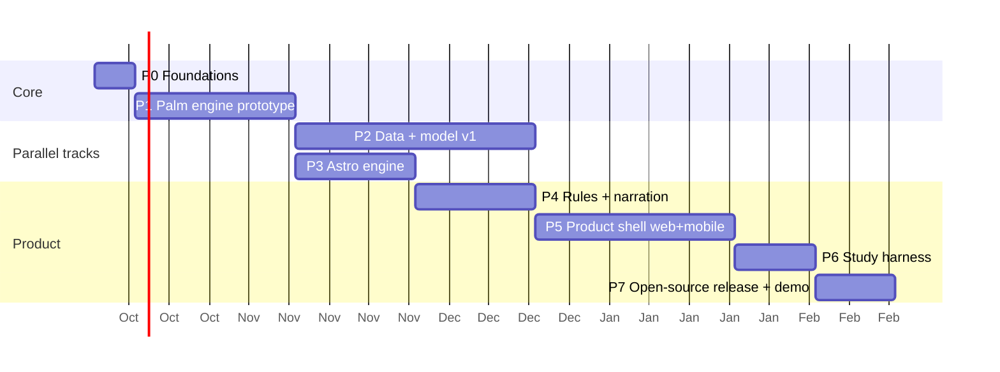

# Palmistry Portal: Implementation Plan

**Builder:** owner + Claude Code (solo)
**Architecture:** [ARCHITECTURE.md](ARCHITECTURE.md)
**Decisions:** [DECISIONS.md](DECISIONS.md)
**Resources to review:** [RESOURCES-REGISTRY.md](RESOURCES-REGISTRY.md)
**Mode:** open source during R&D (D-011). SQLite (D-012). No payments (D-013).
**Method:**
- Test-driven development: write the test first, then the implementation.
- Aim for at least 80% coverage on engine and API code.
- Each phase ends with an exit review against its acceptance criteria.

Durations are rough solo estimates. Phases 2 (data/model) and 3 (astrology) can run in parallel with product work once Phase 1 is done.

---

## Phase 0: Foundations (about 1 week)

**Goal:** an empty but deployable skeleton with CI.

| # | Task | Output |
|---|---|---|
| 0.1 | `git init`, `.gitignore` (data/, var/, weights, .env*), `.editorconfig`, conventional commits, public GitHub repo, branch protection | Repo |
| 0.1b | Open-source files: `LICENSE` (Apache-2.0), `LICENSE-CONTENT` (CC BY 4.0), `NOTICE`, `README` quick start, `CONTRIBUTING` (DCO sign-off, no real photos in PRs), `CODE_OF_CONDUCT`, `SECURITY.md`, issue and PR templates | Contributor-ready repo |
| 0.2 | pnpm + Turborepo workspace: `apps/web`, `apps/mobile`, `packages/{contracts,ui,i18n,reading}` | Monorepo builds |
| 0.3 | `services/engine`: uv project, FastAPI `/healthz`, ruff, mypy (strict), pytest, Dockerfile | Engine container |
| 0.4 | Contract pipeline: Pydantic → JSON Schema → `json-schema-to-typescript` + zod → `packages/contracts`. CI fails if the generated files are stale. | One source of truth for types |
| 0.5 | SQLite + Drizzle: `db/` with first migration (`profiles`, `consents`), `db/schema.sql` snapshot, `pnpm db:migrate` / `db:reset`, repository layer with tests that one profile cannot read another's rows | DB baseline, one-command setup |
| 0.5b | `StorageAdapter` (local filesystem under `var/uploads`) + `Narrator` interface (template default) + `EphemerisProvider` interface | Adapters |
| 0.6 | GitHub Actions: lint, type-check, unit tests, Docker build, contract check, "no real images" check, import-linter (core must not import `adapters-agpl`) | Green CI |
| 0.7 | `docker-compose.yml` (web + engine + `var/` volume) and a no-Docker path (`pnpm dev` + `uv run engine`); service-to-service auth stub; `.env.example` | One-command local run |
| 0.8 | `scripts/fetch-data.sh` + `data/manifest.yaml`, `scripts/fetch-models.sh` (checksums verified) | Reproducible R&D data |

**Exit:** a fresh clone runs end to end with `docker compose up`, with no cloud accounts. CI is green.

**Status (2026-09-29): done.** Public repo https://github.com/atultiwari/grahrekha; CI covers the guard, engine, TypeScript, the mobile bundle and a docker compose smoke test.

Changes from the original plan:
- `packages/ui`, `packages/i18n` and `packages/reading` (the Narrator interface) are created in the phases that first give them content (Phases 4–5), rather than as empty shells.
- The `StorageAdapter` and provider registry (entry points, AGPL boundary test) are done.

---

## Phase 1: Palm engine prototype (milestone 1, about 4 weeks)

**Goal:** prove the chain photo → quality gate → lines → measured features → rule-based reading, honestly and deterministically.

**Scope:**
- Web only, with a minimal UI.
- No accounts and no payments.
- Template text only (no LLM yet).

### 1A. Evaluation data first (days 1–4)

This comes first so there is something to test against before any engine code exists. It now starts from **downloaded R&D datasets** (D-014); consented photos are added as they come in.

| # | Task |
|---|---|
| 1A.1 | Download the Tier 1 bundle (see RESOURCES-REGISTRY §1) into `data/`. Record every item in `data/manifest.yaml`. |
| 1A.2 | **Positive eval set:** 150 palm-side images sampled across the datasets. Stratify by source, skin tone and hand, and freeze the list as `data/splits/eval_v1.txt`. |
| 1A.3 | **Negative eval set:** about 300 images — back-of-hand (11K Hands dorsal), paws, feet, faces, objects, hand drawings. Freeze as `data/splits/negatives_v1.txt`. |
| 1A.4 | Line ground truth: use the PLSU masks (and Roboflow labels if you download them), plus polyline annotation in CVAT/Label Studio of about 60 images that have no labels. |
| 1A.5 | Test–retest: 11K Hands has several palm photos per person, so use those. Add owner-captured phone photos (20 hands × 3 photos) when available; downloaded datasets are mostly scanner/studio images, so real phone photos remain important. |

### 1B. Quality gate and rectification

| # | Task (write the test first) | Acceptance |
|---|---|---|
| 1B.1 | `palm/io.py`: decode, EXIF orientation, strip metadata, resize to long edge 1600. Reject non-images and files over 20 MB. | Unit tests for rotated, huge and corrupt inputs |
| 1B.2 | `palm/quality/landmarks.py`: MediaPipe Hand Landmarker (Python, IMAGE mode) → 21 points + handedness | Fixture tests |
| 1B.3 | `palm/quality/gate.py`: all reason codes (§4.2 of ARCHITECTURE.md), thresholds in `config/gate.yaml` | Negative set ≥ 97% rejected; good set ≤ 5% false rejects |
| 1B.4 | `palm/rectify.py`: homography to the canonical template, mirror right hands, keep the inverse transform | Round-trip error < 2 px on landmarks |

### 1C. Line detection

| # | Task | Acceptance |
|---|---|---|
| 1C.1 | `palm/segment/onnx_runner.py`: load palm-line-reader `student_fp16.onnx` (prototype only; D-006). Pin the model file by sha256, with a model card. | Output shapes tested |
| 1C.2 | `palm/segment/postprocess.py`: hysteresis threshold → skeletonise → prune spurs → link segments | Synthetic line fixtures |
| 1C.3 | `palm/segment/classical.py`: Frangi ridge + Dijkstra minimal path per line between anatomical zones; confidence = agreement with the model | Tested on synthetic crease images |
| 1C.4 | `palm/zones.py`: named zones in the canonical frame (percussion, under_jupiter, …) plus line-identity checks against anatomical priors | Unit tests |
| 1C.5 | Fate line: the v0 model has no fate class, so use the classical detector only and mark `source: classical`, with lower confidence | Documented limitation |

### 1D. Features and contract

| # | Task | Acceptance |
|---|---|---|
| 1D.1 | `palm/features/lines.py`: length, start and end zones, curvature, slope, breaks, forks, contrast, head–life join | Hand-built geometric fixtures give exact values |
| 1D.2 | `palm/features/hand.py`: palm length/width ratio, finger/palm ratio, element, 2D:4D, index vs ring, thumb angle | Fixtures |
| 1D.3 | `PalmFeatures v1` Pydantic model + JSON Schema export + TypeScript types | Contract check in CI |
| 1D.4 | Feature bucketing for stable rule inputs, plus `feature_hash` | Test–retest agreement measured |
| 1D.5 | `POST /palm/analyze` (multipart) → `{gate, features, overlay}`. Stateless, limited concurrency, request timeout. | Integration test; p95 < 2.5 s |

### 1E. Minimal rules and reading

| # | Task |
|---|---|
| 1E.1 | Rule schema (JSON Schema) + loader + JSONLogic evaluator (`rules/`), with the CI lint for citations and the health-claim ban list |
| 1E.2 | Extract about 40 rules for heart, head and life lines plus hand shape from **Cheiro, *Palmistry for All*** (Gutenberg plain text) and **Benham** (IA OCR). Every rule is marked `extracted` and cites its locator. |
| 1E.3 | English template for each `statement_key` → a deterministic reading with no LLM |
| 1E.4 | `POST /rules/evaluate` |

### 1F. Prototype UI (`apps/web/app/lab`, not public)

| # | Task |
|---|---|
| 1F.1 | Upload or camera page with the MediaPipe WASM live guide and auto-capture |
| 1F.2 | Result page: original photo + SVG overlay of landmarks and lines, gate result, features table, fired rules with book citations, template reading |
| 1F.3 | "Wrong line" editor: drag polyline points and save as JSON locally. This is the future training-data path. |
| 1F.4 | End-to-end test (Playwright): fixture photo → overlay visible → reading shows up; non-palm fixture → rejection reason shown |

### 1G. Evaluation report

- `services/engine/tests/eval/run_eval.py` produces `docs/eval/2026-xx-phase1.md` covering:
  - rejection rates;
  - per-line recall and clDice;
  - test–retest agreement;
  - latency;
  - skin-tone and age slices.

**Status (2026-09-29): Phase 1 prototype complete.** Four criteria met, two missed (line recall 0.843; test–retest 0.77), and the owner review is pending. See [docs/eval/phase1-report.md](eval/phase1-report.md). Recommendation: Phase 2 next.

**Phase 1 exit criteria:**

| Criterion | Target |
|---|---|
| Non-palm rejection | ≥ 97% |
| False rejects | ≤ 5% |
| Per-line recall on eval set (heart/head/life) | ≥ 0.85 |
| Test–retest categorical agreement | ≥ 85% |
| Engine p95 | < 2.5 s |
| Rules | Every fired rule is traceable to a book citation |
| Owner review | You review 20 readings and judge them "faithful to the rules as written" |

**If line recall misses the target:** go to Phase 2 first and train our own model before building product UI on top.

---

## Phase 2: Data pipeline and model v1 (about 6 weeks, parallel)

**Goal:** a production-licensed segmenter with a fate line and later minor lines (D-006).

| # | Task |
|---|---|
| 2.1 | Provenance audit of the Roboflow CC BY sets (docseg 7.1k keypoints, cv2project 1.1k segmentation, 24rd021 506 multi-line, palmlinesdetection 403). Keep only audited sets; write an attribution file. |
| 2.2 | Unified dataset format (image + per-line polylines + metadata + licence); converters (keypoint → thick polyline mask; instance segmentation → per-class mask) |
| 2.3 | Pseudo-labelling: run v0 model + classical detector over Kaggle `feyiamujo/human-palm-images` (CC BY, 800 images) and the audited sets; correct them in CVAT |
| 2.4 | Synthetic pretraining data from Diff-Palm / PCE-Palm code (Apache). Check the licences of their checkpoints; retrain if needed. |
| 2.5 | Consented user-correction pipeline: `line_corrections` → `training_samples` (with `training_data` consent only) |
| 2.6 | Training: SMP UNet, MiT-b0 and MiT-b2 encoders, Dice + clDice + connectivity loss, 6 classes. Track experiments locally or with W&B. A single GPU is enough (Colab, Kaggle or a rented A10). |
| 2.7 | Export to ONNX fp16/int8; write a model card; A/B against v0 on the eval set; promote through config |
| 2.8 | Grow the eval set to 300 or more palms, balanced across skin tones and age bands |

**Exit:** v1 beats v0 on per-line recall and clDice with no fairness slice regressing. The fate line has recall ≥ 0.7. The model card lists only allowed licences.

---

## Phase 3: Astrology engine (about 3 weeks, parallel)

| # | Task | Acceptance |
|---|---|---|
| 3.1 | `astro/geo.py`: place search (Indian place table in Postgres + global geocoder), historical timezone resolution | Tests for IST, pre-1947 Indian offsets, DST zones |
| 3.2 | `astro/chart.py` wrapping jyotishganit: Lagna, houses, grahas, nakshatras, D1/D9 | — |
| 3.3 | `astro/dasha.py`: Vimshottari maha and antar periods, current period, `time_confidence` handling | — |
| 3.4 | Validation harness: 30 reference charts compared with PyJHora outputs, offline and test-only (AGPL, never shipped) | Longitude < 0.05°, dasha boundaries < 1 day |
| 3.5 | `astro_chart.v1` contract + `POST /astro/chart` | Contract in CI |
| 3.6 | Astro rule extraction (about 40 rules, e.g. mahadasha lord × domain) from public-domain Jyotish texts; same YAML schema, `engine: astro` | Lint passes |

**Exit:** D-005 confirmed or switched to the Swiss Ephemeris paid licence. Astro-only template readings work.

**Status (2026-09-30): 3.1–3.5 done; 3.6 waits on the owner's choice of public-domain Jyotish sources.**
- 3.1: offline birthplace search over GeoNames `cities5000` (~70k places; official, old and Devanagari names; `GET /v1/places`; attribution returned with every response) instead of a Postgres table plus an online geocoder, because the engine has no internet (D-016). Historical offsets via zoneinfo, including pre-1947 Indian ones.
- 3.2–3.3: `astro/chart.py` (D1, nakshatras, Vimshottari maha/antar dashas for an explicit reference date; unknown birth time withholds lagna and houses). D9 is not exposed yet.
- 3.4: 30 reference charts against Swiss Ephemeris in `adapters-agpl`: planets ≤ 0.003°, nodes 0.0007° after our Rahu fix, dashas ≤ 1 day. D-005 confirmed. See [docs/eval/astro-validation.md](eval/astro-validation.md).
- 3.5: `astro_request.v1`, `astro_chart.v1` and `places_response.v1` are generated to TypeScript, and CI runs a chart and a place search inside the isolated engine container.

---

## Phase 4: Rules at scale and LLM narration (about 3 weeks)

| # | Task |
|---|---|
| 4.1 | Rule extraction at scale: an LLM-assisted extractor turns book chapters into YAML candidates (Cheiro *Language of the Hand*, Benham, Dale *Indian Palmistry*, Samudrika 1916). Target 250+ palm rules, all `extracted`. |
| 4.2 | Rule review UI (`/lab/rules`): filter by line or domain, see the source excerpt, approve/reject/edit, write back to YAML via a PR or a local file |
| 4.3 | `packages/reading`: composer (select top rules per domain), narration prompt, JSON output validation (each sentence carries rule_ids), ban-list post-filter, template fallback |
| 4.4 | Narration cache keyed by (feature_hash or chart hash, rulebase_version, narrator_version, locale) |
| 4.5 | Hindi: glossary + narration in Hindi + reviewed templates. Golden tests with 20 fixed inputs → snapshot outputs. |
| 4.6 | "Why" provenance payload for the UI: rule → citation → feature values |

**Exit:** narrated readings in English and Hindi. 100% of sentences trace back to rules. Zero ban-list violations across 500 generated readings.

---

## Phase 5: Product shell, web and mobile (about 5 weeks)

| # | Task |
|---|---|
| 5.1 | Better Auth on SQLite (email OTP + Google; phone OTP for India later), `profiles`, market and locale routing `/[market]/[locale]` |
| 5.2 | Consent flow (processing, biometric, retain_images, training_data, research) with versioned copy in English and Hindi. 18+ gate. |
| 5.3 | Capture persistence: `palm_captures`, `StorageAdapter` `captures-tmp/`, **scheduled deletion after 24 h** (`cleanup-uploads.ts`) + a test that proves deletion |
| 5.4 | Readings API: `POST /api/readings`, `GET /api/readings/:id`; statements with provenance; rate limits; Turnstile only on the public demo |
| 5.5 | Report UI: source badges, "why" popovers, synced overlay, both-hands comparison, PDF export, share card (`@vercel/og`) |
| 5.6 | Expo app: auth, consent, vision-camera capture with a static guide, upload, overlay (react-native-svg), report, push notifications. Runs in Expo Go or a dev build; store builds come later. |
| 5.7 | Account: data export, delete account (cascade), withdraw consent |
| 5.8 | Legal and method pages: privacy, terms, disclaimer, "How it works and what the evidence says" (from research 03), sub-processor list |
| 5.9 | PostHog funnel events, Sentry (personal data scrubbed) |

**Exit:** a stranger can complete the flow end to end on web and on a mobile test build. Security review (below) has no critical or high findings.

---

## Phase 6: Validation study harness (about 2 weeks)

| # | Task |
|---|---|
| 6.1 | Write `docs/study/PREREGISTRATION.md` (hypotheses, arms, primary metric = forced-choice hit rate vs 50%, sample size by power analysis, stopping rule) **before any data** |
| 6.2 | Arms: palm / astro / combined / control_shuffled. Stratified randomisation stored in `study_assignments`. |
| 6.3 | Blinded UI; statement ratings; overall rating; "which is yours?" forced choice; debrief screen |
| 6.4 | Life-event check-ins (3, 6 and 12 months) via push or email; `life_events` table |
| 6.5 | Analysis views (no personal data) + notebook `ml/study/analysis.ipynb` |

**Exit:** a pilot of about 30 participants runs cleanly, and the data exports correctly.

---

## Phase 7: Open-source release and public demo (about 2 weeks)

| # | Task |
|---|---|
| 7.1 | Security review (security-reviewer agent + manual): authorisation tests, upload hardening, service auth, secrets, rate limits, dependency audit |
| 7.2 | Public demo instance: a small VM or PaaS running web + engine, SQLite on a volume. Nightly backup of `app.db`; 24 h image deletion verified. |
| 7.3 | Contributor experience: "good first issue" labels; docs for adding a rule, running the evaluation on your own images, and adding a provider; Discussions enabled |
| 7.4 | Public "Accuracy and consistency" page generated from `docs/eval/`; published pre-registration |
| 7.5 | Load test the engine (k6); LLM cost guard (the demo defaults to the template narrator; LLM behind a flag and quota) |
| 7.6 | SEO base: per-line and per-domain pages in English and Hindi with the scanner embedded; sitemap; OG images |

**Exit:** public repo announced, demo live, first external contributors can run everything locally.

## Deferred until the owner asks (D-013)

- Payment gateways (Razorpay/UPI for `in`, Stripe for `global`), `orders` table, webhooks.
- Pricing, paywall UI, subscriptions.
- App Store / Play Store submission (needs accurate privacy labels).
- Migrating SQLite → Postgres and local storage → S3 (needed for a paid multi-user service; adapters are ready).

## Cross-cutting practices

- **Test-driven development for every engine function.**
  - Geometric fixtures: synthetic images with known lines.
  - Contract tests.
  - Golden snapshot tests for readings.
  - Playwright tests for the web flow.
  - Maestro or Detox later for mobile.
- **Versioning:** `engine`, `segmenter`, `gate`, `rulebase` and `narrator` versions are stamped on every stored output. No silent changes.
- **Code review:** code-reviewer agent after each feature. security-reviewer agent for auth, uploads and payments.
- **Docs:** update ARCHITECTURE.md and DECISIONS.md when a decision changes. Keep runbooks in `docs/runbooks/` (deploys, deletion job, incident response).

## Top risks

| Risk | Impact | Mitigation |
|---|---|---|
| Line detection on real phone photos is worse than hoped (research shows sharp drops on real-world data) | Readings are wrong or inconsistent | Evaluate before building UI, classical cross-check, line-correction editor, invest in Phase 2 data |
| Unclear data licences contaminate production weights | Legal | D-006/D-014: R&D data stays git-ignored; registry must be "cleared" before production; model cards |
| Downloaded datasets are studio or scanner images, not phone photos | Model looks better in evaluation than in real use | Keep a phone-photo slice in the eval set; collect consented phone photos in parallel |
| An AGPL component gets imported into core by accident | Licence contamination | import-linter in CI; AGPL code only in `adapters-agpl/` |
| The owner's rule review becomes a bottleneck | Rules stay `extracted` | Ship approved core rules first; `reviewed`-status rules only in the study arm |
| LLM cost or latency | Cost for the demo | Narrate from compact JSON, cache, Haiku by default, template fallback |
| Solo bandwidth across web and mobile | Delays | Shared packages; mobile v1 uses the server gate only; web leads by about 1 sprint |
| Regulatory (DPDP 2027 duties, BIPA) | Fines, trust | Consent-first design, 24 h deletion, no health claims, legal review before launch |
| Study shows no signal beyond control | Product positioning | Frame as entertainment and self-reflection. Publishing the result honestly still builds trust. |

## Immediate next steps

1. Owner reviews `docs/RESOURCES-REGISTRY.md` and approves the Tier 1 download bundle.
2. Download the Tier 1 bundle into `data/` (git-ignored) and write `data/manifest.yaml`.
3. Phase 0: scaffold the monorepo, the open-source files, SQLite and CI.
4. Phase 1A: freeze the evaluation splits, then start the engine work using test-driven development.
